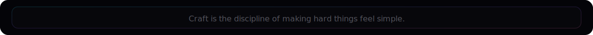
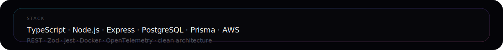
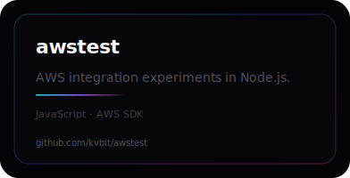
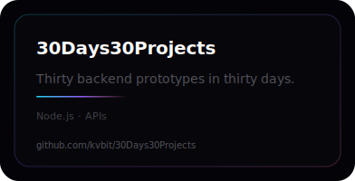
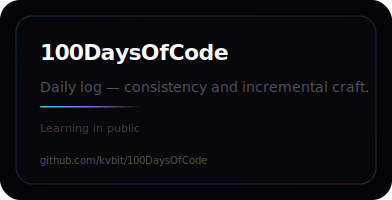

<!-- Jahangir Ahmad · kvbit · Backend Engineer -->

 

 

  
  
  
  
  
  

 

  

 

 

[Arclight](https://github.com/kvbit/Arclight) · [30Days30Projects](https://github.com/kvbit/30Days30Projects) · [100DaysOfCode](https://github.com/kvbit/100DaysOfCode)

`bcw-platform` — TypeScript, Express, Prisma, PostgreSQL, AWS Cognito, OpenTelemetry

  

  

  

<table width="100%"><tr>
<td width="33%" align="center"></td>
<td width="33%" align="center"></td>
<td width="33%" align="center"></td>
</tr></table>

  

  
  &nbsp;&nbsp;
  

 

  
  &nbsp;&nbsp;
  

 

  

  
  &nbsp;&nbsp;
  
  &nbsp;&nbsp;
  

  

 

  
  

 

