<!--
  ────────────────────────────────────────────────────────────
  kvbit / Jahangir Ahmad — profile transmission
  Every visual below is a handcrafted, animated SVG in /assets.
  No templates. No cards. Dark terminals only.
  ────────────────────────────────────────────────────────────
-->

<!-- 00 // BOOT -->

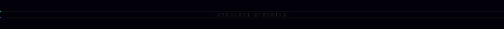

<!-- 01 // IDENTITY -->

<!-- 02 // MISSION -->

<!-- 03 // CURRENT FOCUS -->
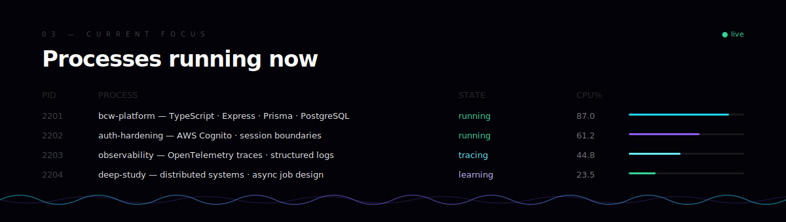

<!-- 04 // ENGINEERING PHILOSOPHY -->
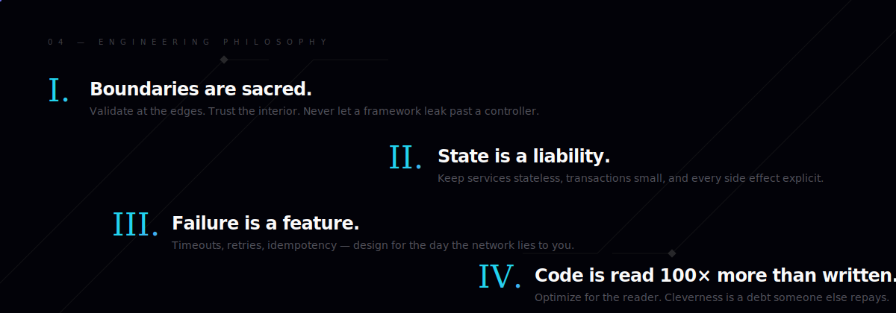

<!-- 05 // TECH UNIVERSE -->

<!-- 06 // DEPLOYMENTS -->

  <code>$ open</code>&nbsp;
  <a href="https://github.com/kvbit/Arclight"><code>arclight</code></a>&nbsp;·&nbsp;
  <a href="https://github.com/kvbit/30Days30Projects"><code>30days</code></a>&nbsp;·&nbsp;
  <a href="https://github.com/kvbit/100DaysOfCode"><code>100days</code></a>&nbsp;·&nbsp;
  <a href="https://github.com/kvbit?tab=repositories"><code>--all</code></a>

<!-- 07 // ARCHITECTURE -->
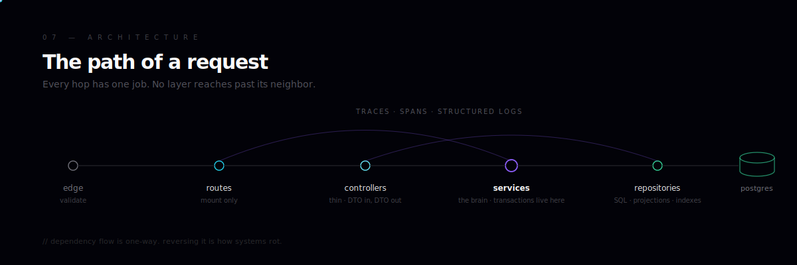

<!-- 08 // OPEN SIGNALS — live telemetry -->

  

<!-- 09 // MILESTONES -->
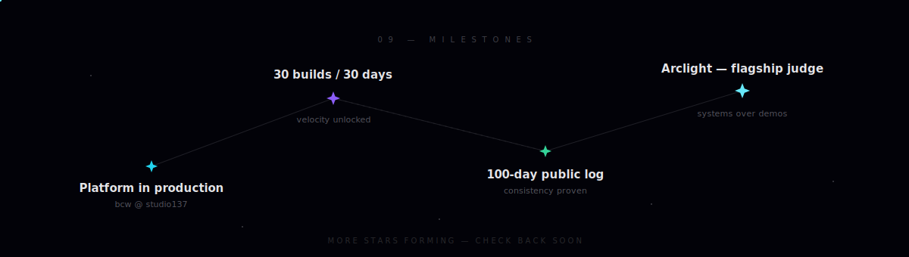

<!-- 10 // FIELD NOTES -->
<a href="https://github.com/kvbit/100DaysOfCode">
  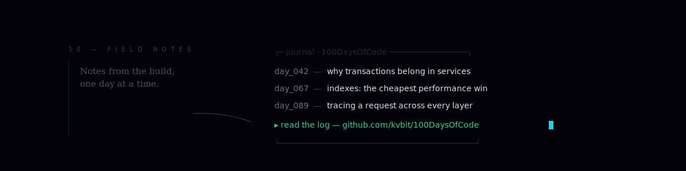
</a>

<!-- 11 // UPLINK -->
<a href="mailto:mailboxmelted@gmail.com">
  
</a>

<!-- EOF -->

